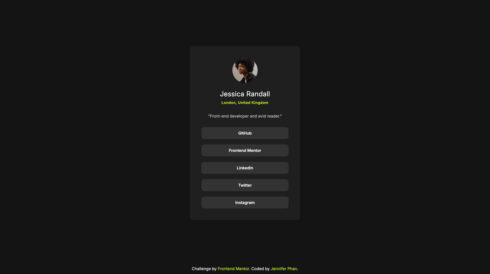

# Frontend Mentor - Social links profile solution

This is a solution to the [Social links profile challenge on Frontend Mentor](https://www.frontendmentor.io/challenges/social-links-profile-UG32l9m6dQ). Frontend Mentor challenges help you improve your coding skills by building realistic projects. 

## Table of contents

- [Overview](#overview)
  - [The challenge](#the-challenge)
  - [Screenshot](#screenshot)
  - [Links](#links)
- [My process](#my-process)
  - [Built with](#built-with)
  - [What I learned](#what-i-learned)
  - [Continued development](#continued-development)
- [Author](#author)

## Overview

### The challenge

Users should be able to:

- See hover and focus states for all interactive elements on the page

### Screenshot



### Links

- Solution URL: [Solution](https://www.frontendmentor.io/solutions/social-links-profile-card-with-semantic-html-bem-and-accessible-css-Pl0dMcrYWM)
- Live Site URL: [Live site](https://your-live-site-url.com)

## My process

### Built with

- Semantic HTML5 markup
- CSS custom properties
- Flexbox
- CSS Grid
- Mobile-first workflow
- BEM naming methodology
- Accessibility practices

### What I learned

This project helped me practice writing more maintainable CSS using root variables and BEM naming convention. It also helped me practice using semantic HTML.

```css
.card__btn:hover,
.card__btn:focus {
   background-color: var(--clr-primary);
   color: var(--clr-gray-900);
   outline: none;
}
```

### Continued development

I would like to practice more efficient and consistent margin/padding and font sizes to make the project look more organized and professional.

## Author

- Github - [@jenphan](https://www.github.com/jenphan)
- Frontend Mentor - [@jenphan](https://www.frontendmentor.io/profile/jenphan)
